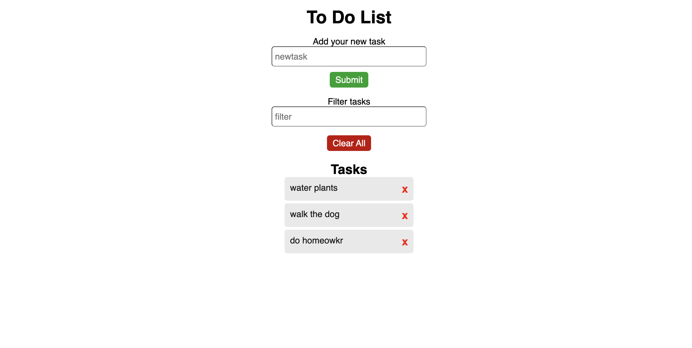

# To Do List

Classic to do list application made with html, css, and vanilla javascript. Add new tasks to your list, delete old ones, and apply a filter. Data stored in local storage.

# Screenshots

## Getting Started

Simply open index.html file with the browser.

## Authors

- **Christopher Coyne**
